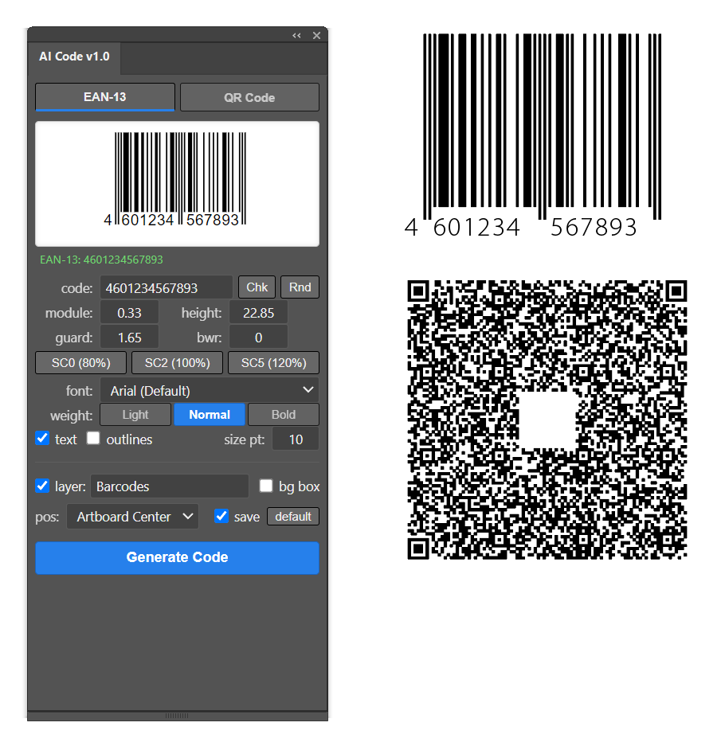
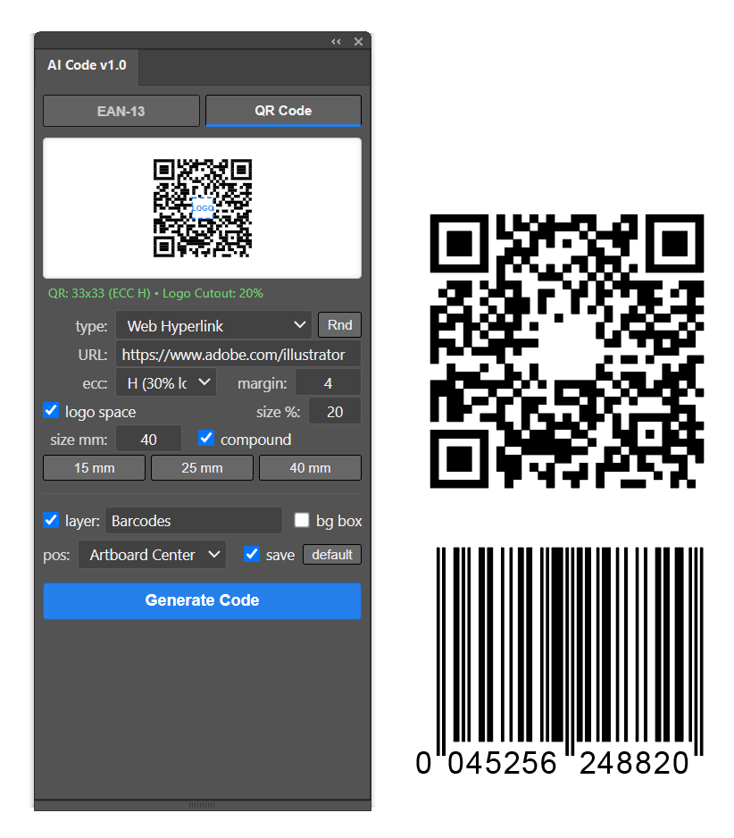

# AI Code v1.0

<p align="center">
  
  &nbsp;
  
</p>

*( 🇬🇧 [English](#english) | 🇷🇺 [Русский](#русский) )*

---

<a id="english"></a>
## 🇬🇧 English

**AI Code** is a professional CEP extension (panel) for Adobe Illustrator designed to generate 100% pure vector **EAN-13 barcodes** and **QR Codes** directly into your artwork.

The plugin provides high-precision vector geometry, full GS1 standard compliance for packaging/retail barcodes, and InDesign-compatible QR code generation with rich data types (vCard, SMS, Email, Hyperlink, Plain Text) and a dedicated **Logo Space cutout** option.

### Main Features and Capabilities
* **Cross-platform** — Fully supports **Windows** and **macOS** (including Intel, Apple Silicon M1/M2/M3/M4 & macOS Sequoia).
* **100% Vector Geometry** — Generates clean compound paths (`CompoundPathItem`) and crisp vector rectangles without overlapping seams or raster artifacts.
* **Pure Black Output** — Clean 100% K black vector shapes directly placed onto your artboard.
* **Live SVG Preview** — Real-time visual feedback and instant data validation badge before inserting codes into Illustrator.
* **Random Sample Generator (`Rnd`)** — One-click generation of realistic sample data for all code types (EAN-13, vCards, SMS, Emails, Wi-Fi/batches, and URLs).
* **Settings Preservation** — Automatically remembers all your settings and last entered values across Illustrator sessions.
* **Reset to Factory Defaults (`default`)** — Instantly reset all options and parameters back to clean initial states.

### Barcode & QR Features

#### 🅰️ EAN-13 Barcode (Retail & Packaging)
* **Automatic 13th Checksum Calculation (Modulo-10)** — Auto-calculates check digit for 12 digits or validates 13-digit codes. Includes a `Chk` helper button.
* **GS1 / ISO/IEC 15420 Compliant** — Standard extended Guard Bars (Start: `101`, Center: `01010`, End: `101`) and Quiet Zones (11 modules left, 7 modules right).
* **Scaling Presets** — Quick switching between **SC0 (80%)**, **SC2 (100% nominal / 0.33 mm)**, and **SC5 (120%)**.
* **Bar Width Reduction (BWR)** — Configurable reduction in microns (µm) to compensate for ink bleeding in flexographic and offset print.
* **Typography & Fonts**:
  * Default fonts: **Arial** (Windows) and **Helvetica** (macOS).
  * Selection of **any installed font** from Adobe Illustrator (`app.textFonts`).
  * Quick font weight buttons: **`Light`**, **`Normal`**, **`Bold`**.
  * Option to convert digits to vector outlines (`outlines`).

#### 🅱️ QR Code (InDesign Compatible)
* **5 Standard Data Types**:
  * 🌐 **Web Hyperlink** (URLs)
  * 📝 **Plain Text** (Multi-line text, Wi-Fi credentials, batch info)
  * 💬 **Text Message (SMS)** (Phone number & pre-filled message `SMSTO:`)
  * ✉️ **Email** (Recipient, subject line & message body `MATMSG:`)
  * 📇 **Business Card (vCard 3.0)** (Name, title, company, phones, email, website, and address)
* **Logo Space Cutout** — Configurable central empty area (10% to 30% width) for seamless placement of custom logos and branding.
* **Error Correction Levels (ECC)** — **L (7%)**, **M (15%)**, **Q (25%)**, and **H (30% logo recovery)**.
* **Quick Size Presets** — **15 mm**, **25 mm**, and **40 mm**.
* **Compound Path** — Combines all QR modules into a single compound path for 1-click recoloring and manipulation.

### Placement & Organization
* **Smart Positioning** — Center on **Active Artboard** or Center on **Selected Object**.
* **Layer Management** — Automatically create and place barcodes onto a dedicated layer (e.g. `Barcodes`) or the active layer.
* **Background Box** — Optional clean white background box with quiet margins.

---

### Installation

The plugin supports Adobe Illustrator CC 2014 – 2026+ on Windows & macOS.

#### Windows:
1. **Enable Debug Mode:** Run the `enable_player_debug_mode.reg` file by double-clicking it and confirm adding changes to the registry.
2. **Copy Files:** Press `Win + R`, paste `%APPDATA%\Adobe\CEP\extensions\`, and copy the `AI Code` folder there.
3. **Launch:** Restart Illustrator -> `Window -> Extensions -> AI Code` (or `Extensions (Legacy)`).

#### macOS:
1. **Enable Debug Mode:** Open Terminal and execute:
   ```bash
   defaults write com.adobe.CSXS.9 PlayerDebugMode 1; defaults write com.adobe.CSXS.10 PlayerDebugMode 1; defaults write com.adobe.CSXS.11 PlayerDebugMode 1; defaults write com.adobe.CSXS.12 PlayerDebugMode 1; defaults write com.adobe.CSXS.13 PlayerDebugMode 1; defaults write com.adobe.CSXS.14 PlayerDebugMode 1; defaults write com.adobe.CSXS.15 PlayerDebugMode 1; defaults write com.adobe.CSXS.16 PlayerDebugMode 1
   ```
2. **Copy Files:** In Finder press `Cmd + Shift + G`, paste `~/Library/Application Support/Adobe/CEP/extensions/` (create the folder if it doesn't exist), and copy the `AI Code` folder there.
3. **Launch:** Restart Illustrator -> `Window -> Extensions -> AI Code` (or `Extensions (Legacy)`).

---

## 🛠️ Other Projects

**[AI Dimension](https://github.com/SaidAuita/AI-Dimension)**
* A modern CEP panel for Adobe Illustrator to automatically add technical dimensions, linear measurements, radiuses, and center marks.

**[ID Dimension](https://github.com/SaidAuita/ID-Dimension)**
* Technical dimensioning tool designed specifically for Adobe InDesign (includes CEP panel and ScriptUI palette).

**[ComfyUI Photoshop Plugin (PH-CU-S)](https://github.com/SaidAuita/ComfyUI_PH-CU-S)**
* A powerful Photoshop plugin powered by ComfyUI, providing direct integration with local generative models without any clouds, subscriptions, or recurring fees.

---

<a id="русский"></a>
## 🇷🇺 Русский

**AI Code** — это профессиональная CEP-панель (плагин) для Adobe Illustrator, предназначенная для генерации высокоточных векторных штрихкодов **EAN-13** и **QR-кодов** прямо в рабочем документе.

Плагин обеспечивает построение 100% векторной геометрии, полное соответствие стандартам GS1 для упаковки и ритейла, а также совместимость с форматами QR-кодов Adobe InDesign (визитки vCard, SMS, Email, ссылки, текст) с поддержкой **окна под логотип (Logo Space)**.

### Основные возможности
* **Кроссплатформенность** — полная поддержка **Windows** и **macOS** (включая Intel, Apple Silicon M1/M2/M3/M4 и macOS Sequoia).
* **100% Векторная графика** — создание чистых составных контуров (`CompoundPathItem`) без растровых артефактов и микрозазоров.
* **Чистый черный цвет** — формирование векторных объектов со 100% черным цветом (100% K в CMYK / 0,0,0 в RGB).
* **Интерактивное превью (Live SVG Preview)** — мгновенная визуализация и валидация данных прямо в панели перед вставкой в документ.
* **Генератор случайных реалистичных данных (`Rnd`)** — заполнение осмысленными образцами в один клик для всех типов кодов (EAN-13, vCard, SMS, Email, URL, текст).
* **Сохранение настроек** — автоматическое сохранение параметров между сессиями работы в Illustrator.
* **Сброс настроек (`default`)** — быстрый возврат к заводским параметрам по умолчанию.

### Функционал

#### 🅰️ Штрихкод EAN-13 (Упаковка и ритейл)
* **Автоматический расчет 13-й контрольной цифры (Modulo-10)** — мгновенный расчет контрольной суммы для 12 цифр или проверка корректности 13-значного кода. Кнопка `Chk`.
* **Соответствие стандарту GS1 / ISO/IEC 15420** — стандартные удлиненные Guard-полосы (Start: `101`, Center: `01010`, End: `101`) и зоны тишины (Quiet Zones: 11 модулей слева, 7 справа).
* **Пресеты масштабирования** — быстрое переключение между **SC0 (80%)**, **SC2 (100% номинал / 0.33 мм)** и **SC5 (120%)**.
* **Редукция ширины штриха (BWR)** — настройка компенсации растискивания краски в микрометрах (µm) для качественной флексо- и офсетной печати.
* **Типографика и шрифты**:
  * Шрифты по умолчанию: **Arial** (Windows) и **Helvetica** (macOS).
  * Выбор **любого установленного шрифта** из системы через `app.textFonts`.
  * Кнопки выбора начертания: **`Light`**, **`Normal`**, **`Bold`**.
  * Опция перевода цифр в кривые (`outlines`).

#### 🅱️ QR-код (Совместимость с InDesign)
* **5 Стандартных типов данных**:
  * 🌐 **Web Hyperlink** (URL-адреса сайтов)
  * 📝 **Plain Text** (Произвольный текст, параметры партий, пароли Wi-Fi)
  * 💬 **Text Message (SMS)** (Номер телефона и готовый текст сообщения `SMSTO:`)
  * ✉️ **Email** (Адрес получателя, тема и тело письма `MATMSG:`)
  * 📇 **Business Card (vCard 3.0)** (Имя, должность, компания, телефоны, email, сайт и адрес)
* **Окно под логотип (Logo Space)** — настраиваемая пустая центральная область (от 10% до 30% ширины) для аккуратной вставки векторного логотипа или знака.
* **Уровни коррекции ошибок (ECC)** — **L (7%)**, **M (15%)**, **Q (25%)** и **H (30% под логотип)**.
* **Пресеты размеров** — **15 мм**, **25 мм** и **40 мм**.
* **Составной контур (Compound Path)** — объединение всех модулей QR-кода в единый объект для удобного перекрашивания и перемещения.

### Размещение и слои
* **Позиционирование** — по центру активного артборда (**Artboard Center**) или по центру выделенного объекта (**Selection Center**).
* **Управление слоями** — создание и размещение кодов на специальном слое (например, `Barcodes`) или в активном слое.
* **Фоновая подложка** — опциональный белый прямоугольник (`bg box`) с полями безопасности.

---

### Установка

Плагин поддерживает версии Adobe Illustrator CC 2014 – 2026+ на Windows и macOS.

#### Windows:
1. **Включение режима отладки:** Запустите файл `enable_player_debug_mode.reg` двойным кликом и подтвердите добавление изменений в реестр.
2. **Копирование файлов:** Нажмите `Win + R`, вставьте `%APPDATA%\Adobe\CEP\extensions\` и скопируйте папку `AI Code` туда.
3. **Запуск:** Перезапустите Illustrator -> `Окно -> Расширения -> AI Code` (или `Расширения (устаревшие)`).

#### macOS:
1. **Включение режима отладки:** Откройте терминал и выполните команду:
   ```bash
   defaults write com.adobe.CSXS.9 PlayerDebugMode 1; defaults write com.adobe.CSXS.10 PlayerDebugMode 1; defaults write com.adobe.CSXS.11 PlayerDebugMode 1; defaults write com.adobe.CSXS.12 PlayerDebugMode 1; defaults write com.adobe.CSXS.13 PlayerDebugMode 1; defaults write com.adobe.CSXS.14 PlayerDebugMode 1; defaults write com.adobe.CSXS.15 PlayerDebugMode 1; defaults write com.adobe.CSXS.16 PlayerDebugMode 1
   ```
2. **Копирование файлов:** В Finder нажмите `Cmd + Shift + G`, вставьте `~/Library/Application Support/Adobe/CEP/extensions/` и скопируйте папку `AI Code` туда.
3. **Запуск:** Перезапустите Illustrator -> `Окно -> Расширения -> AI Code` (или `Расширения (устаревшие)`).

---

## 🛠️ Другие проекты

**[AI Dimension](https://github.com/SaidAuita/AI-Dimension)**
* Современная CEP-панель для Adobe Illustrator для автоматической расстановки технических размеров, габаритов, радиусов и центров объектов.

**[ID Dimension](https://github.com/SaidAuita/ID-Dimension)**
* Инструмент образмеривания специально для Adobe InDesign (включает CEP-панель и ScriptUI-палитру).

**[ComfyUI Photoshop Plugin (PH-CU-S)](https://github.com/SaidAuita/ComfyUI_PH-CU-S)**
* Мощный плагин для Photoshop на базе ComfyUI для прямой интеграции с локальными нейросетями без облаков и подписок.
